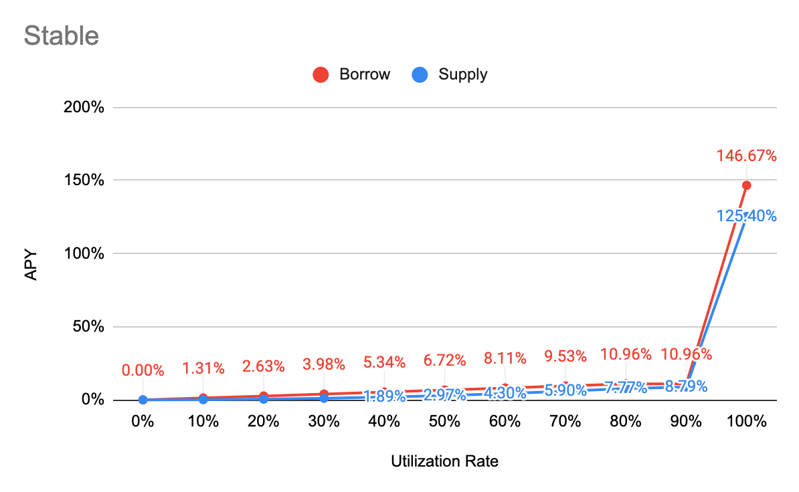
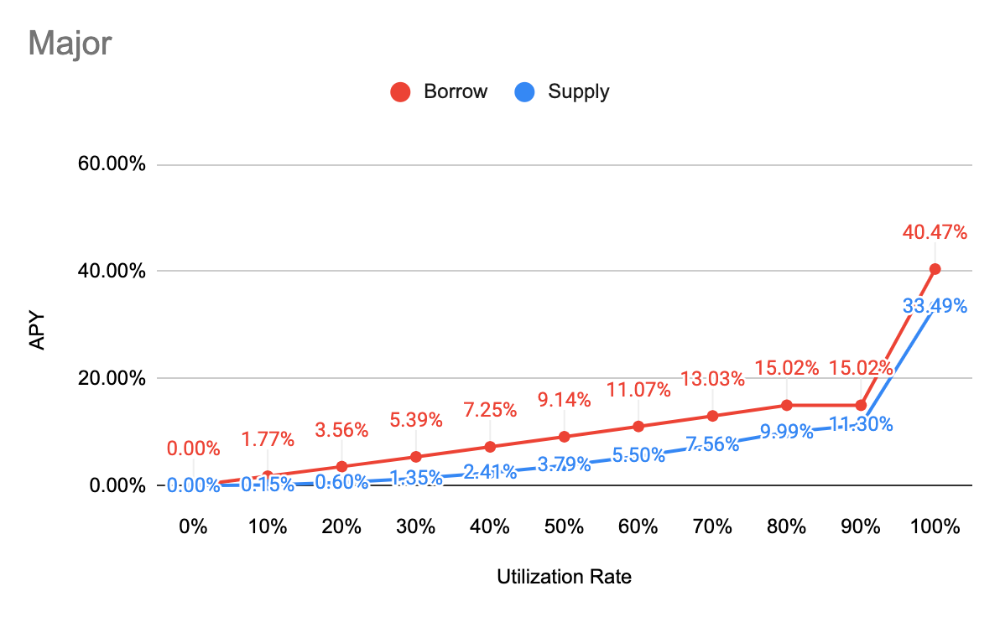

<!--You can leave these HTML comments in your merged FIP and delete the visible duplicate text guides, they will not appear and may be helpful to refer to if you edit it again. This is the suggested template for new FIPs. Note that an FIP number will be assigned by an editor. When opening a pull request to submit your FIP, please use an abbreviated title in the filename, `fip-draft_title_abbrev.md`. The title should be 44 characters or less.-->

## Simple Summary

<!--"If you can't explain it simply, you don't understand it well enough." Simply describe the outcome the proposed changes intends to achieve. This should be non-technical and accessible to a casual community member.-->

This FIP expands on the current fUSD functionality. This FIP introduces changes required to the SFC, sFTM, and fUSD to align each module. These include interest rates, loan-to-value (LTV) ratio’s, and liquidations.

## Risks

Positions that are not overcollateralized by 300% will be liquidated when liquidations go live. Users have until this module activation to repay their debt. Given the current low liquidity of fUSD the foundation will create a fUSD:USDC swap to allow users to purchase fUSD and repay their positions to avoid liquidations.

Should their debt be in sFTM, they will sacrifice their rewards and delegation. If they are a validator, the validator is at risk of being pruned from the network. Once the validator is pruned all stake is slashed.

Delegates need to ensure they are not delegated to any high risk validators as they stand at risk of losing their delegation because of the validators collateral management.

## Specification

Items marked by * are governance parameters

### Staked FTM (sFTM)

* sFTM will be mintable against staked FTM, there will be a global cap of 150m sFTM*
* Validators are not eligible to mint sFTM
* FTM will have a Loan To Value (LTV) ratio of 90% for purposes of minting sFTM*
* sFTM will be transferable
* sFTM/wFTM market will be created and incentivized
* sFTM has a dynamic interest rate based on borrow vs supply (supply being a function of the cap)
* minting fees remain unchanged

| Parameter | Value |
| :--- | :--- |
| Tokens | sFTM |
| Base | 0% |
| Multiplier | 13% |
| JumpMultiplier | 800% |
| Kink 1 | 80% |
| Kink 2 | 90% |

* The liquidation bonus will be 10%*
* When outstanding sFTM >= 80% FTM, that position will become liquidatable
* By burning / repaying sFTM the underlying FTM becomes claimable

### SFC

* `outstandingFTM` liquidated re-assigns the delegator address
* Stake / Delegation is calculated as [stake - outstandingSFTM] for purposes of rewards
* Delegator selfStake [stake - outstandingSFTM] that falls below the minSelfStake will be pruned

### Fantom USD

* fUSD will be mintable against various assets, as described below, there will be a global cap of 50m fUSD*
* fUSD/USD markets will be created and incentivized
* fUSD has a dynamic interest rate based on borrow vs supply (supply being a function of the cap)

| Parameter | Value |
| :--- | :--- |
| Tokens | fUSD |
| Base | 0% |
| Multiplier | 17.5% |
| JumpMultiplier | 200% |
| Kink 1 | 80% |
| Kink 2 | 90% |

* The liquidation bonus will be 10%*
* When outstanding fUSD >= 90% of collateral value in USD (as derived from LTV), that position will become liquidatable
* By burning / repaying fUSD the underlying collateral becomes claimable
* minting fees remain unchanged

### Interest Rate Models

Borrow APY = \[1 + Base + Multiplier \* min\(UtilizationRate, Kink1\) + max\(JumpMultiplier \* UtilizationRate - Kink2, 0\)\] ^ SecondsPerYear - 1

| Parameter | Value |
| :--- | :--- |
| Tokens | sFTM |
| Base | 0% |
| Multiplier | 13% |
| JumpMultiplier | 800% |
| Kink 1 | 80% |
| Kink 2 | 90% |

| Parameter | Value |
| :--- | :--- |
| Tokens | fUSD |
| Base | 0% |
| Multiplier | 17.5% |
| JumpMultiplier | 200% |
| Kink 1 | 80% |
| Kink 2 | 90% |

### Collateral

Collateral factor is the maximum you can borrow on a particular asset.

Cap is the maximum amount mintable against a particular asset.

Example: The collateral factor for FTM is 50%, if the price of FTM is considered as $1000, the max you will be able to mint in fUSD is worth $500

| Token | Collateral Factor | Cap |
| :--- | :--- | :--- |
| sFTMX | 50% | 10m |
| wFTM | 50% | 10m |
| sFTM | 30% | 10m |
| BOO | 10% | 1m |
| BEETS | 10% | 1m |
| SPIRIT | 10% | 1m |
| LQDR | 10% | 1m |
| USDC | 90% | 10m |
| fUSDT | 90% | 10m |
| DAI | 90% | 10m |

### Savings Rate & Fees

fUSD can be staked in the protocol to earn fees. At 90% utilization this results 11.30% APY

10% of interest & fees paid by minters will be used as a liquidity backstop*
90% will be distributed to fUSD stakers*

## Copyright

Copyright and related rights waived via [CC0](https://creativecommons.org/publicdomain/zero/1.0/).
